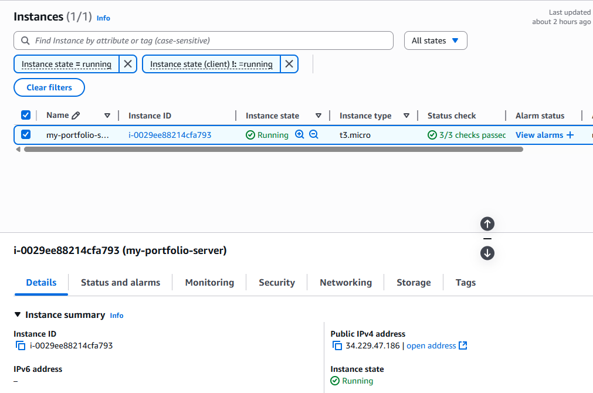
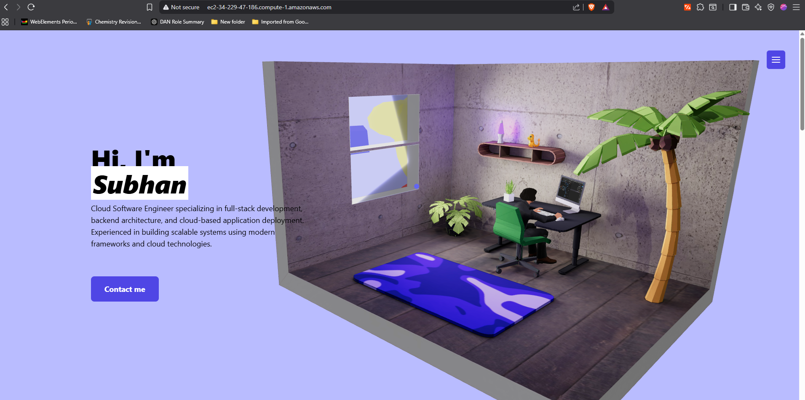
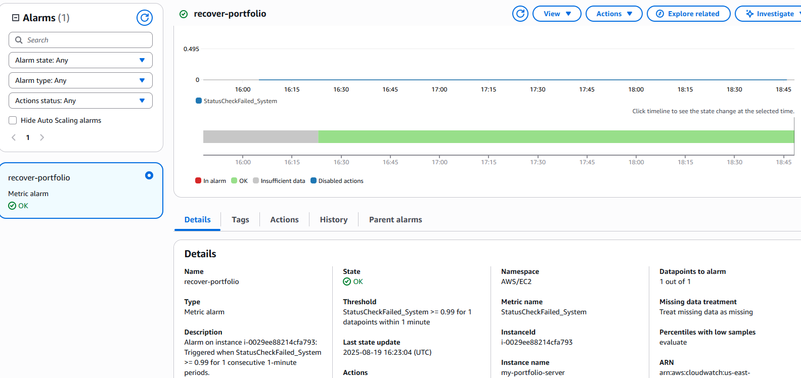

# Cloud Deployed 3D Portfolio on AWS EC2

This project demonstrates how I deployed my personal 3D portfolio (built using Three.js) to an AWS EC2 instance using NGINX. I configured monitoring and auto-recovery with CloudWatch, and secured access with AWS security groups. This simulates a real-world static site deployment and fault-tolerant cloud infrastructure.

## Live Demo

http://<your-ec2-public-ip>  
http://<your-public-dns>  

*(Note: The demo may be unavailable if the instance is stopped or IP changes. An Elastic IP can be attached to make it permanent.)*

---

## Architecture Overview

[Browser]
|
v
[EC2 Public IP / DNS] --> [NGINX Web Server] --> [Portfolio Files in /usr/share/nginx/html]
|
+--> CloudWatch Monitoring + Auto-Recovery

---

## AWS Services Used

- **EC2**: Hosting the application on Amazon Linux 2 (t2.micro free tier).
- **NGINX**: Web server serving static Three.js build files.
- **IAM**: Role assigned for CloudWatch integration.
- **Security Groups**: Configured HTTP (80) for public access and SSH (22) restricted to my own IP.
- **CloudWatch**: Alarm created on `StatusCheckFailed_System` with automatic recovery action.

---

## Project Steps

1. Built the Three.js portfolio using `npm run build`.
2. Created an EC2 instance on Amazon Linux 2 (free tier).
3. Configured security groups to allow HTTP (0.0.0.0/0) and restrict SSH to my laptop IP.
4. Connected via SSH using a `.pem` key.
5. Installed and started NGINX to serve static files.
6. Uploaded the build folder (`dist/`) via SCP to the instance.
7. Copied portfolio files into `/usr/share/nginx/html`.
8. Configured CloudWatch alarm to detect system health check failures.
9. Enabled EC2 auto-recovery tied to that alarm.

---

## Screenshots

Add screenshots into a `/screenshots` folder and reference them here:

- EC2 instance running in AWS Console:  
  

- Portfolio website live on EC2:  
  

- CloudWatch alarm configuration:  
  

---

## What I Learned

- Provisioning and securing an EC2 instance.
- Configuring a Linux server with NGINX for static hosting.
- Using SCP to transfer files securely.
- Managing security groups for controlled access.
- Setting up monitoring and auto-recovery with CloudWatch.
- Understanding real-world cloud hosting and failure recovery processes.

---

## Next Improvements

- Use Elastic IP to ensure a permanent public endpoint.
- Add a custom domain via Route 53.
- Configure HTTPS with Let’s Encrypt and Certbot.
- Automate deployment with Terraform or AWS CDK.

---
